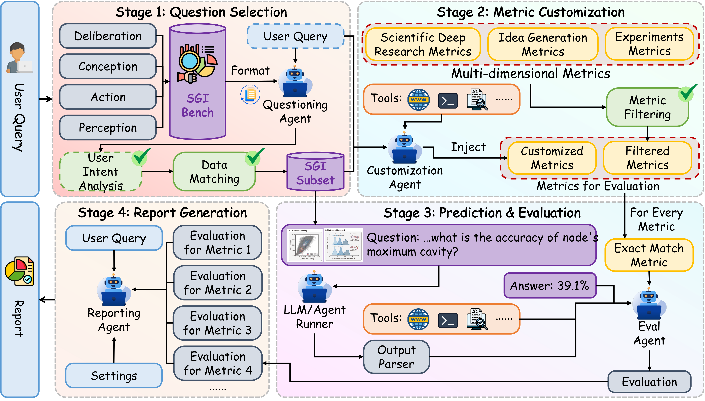
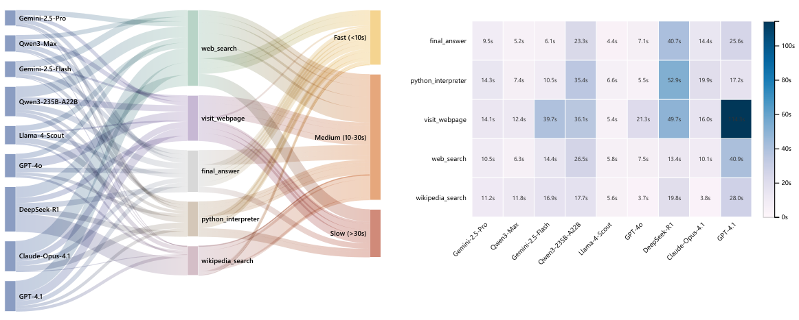

## 还在卷 AGI？SGI 来了：Gemini‑3‑Pro 拿下 SOTA，却仍然显著不及格

我们把“能否做科学”从口号变成刻度。基于实践探究模型（PIM）的四象限理论，我们提出 SGI 的可操作定义，并发布覆盖全流程的 SGI‑Bench。首轮结果显示：闭源旗舰 Gemini‑3‑Pro 以 SGI‑Score 33.83/100 取得 SOTA，但距离“会做研究”的门槛仍有显著差距。

-	深度研究（Deep Research ）答案准确率18.48%（Gemini‑3‑Pro）：最终答案严格匹配率偏低，长链路推理末端易崩塌；
-	创意生成（Idea Generation）平均得分 39.68（Gemini‑3‑Pro）：新颖与详尽度高，但“可行性”弱，关键实现细节不足；
-	干实验（Dry Experiment）代码通过率 36.64%（Gemini‑3‑Pro）：高 SER 并不等于科学正确，数值/仿真最薄弱；
-	湿实验（Wet Experiment）平均得分32.45（Gemini‑3‑Pro）：步骤序列相似度低、参数易错，时间与分支协调困难；
-	实验推理（Scientific Experimental Reasoning）答案准确率41.92%（Gemini‑3‑Pro）：因果尚可，比较型推理最难。

一句话总结：在“科学通用智能”的刻度上，最强模型也仅三十余分，AI 离“像科学家一样做研究”仍需跨越数值稳健、实验规划与比较型多模态等关键门槛。

# SGI-Bench：通往“科学通用智能”的系统路线图——定义、数据、评测与现场进化

> Scientific General Intelligence（SGI）= 能够像人类科学家一样，自治地完成科学探究的完整、迭代循环（审思—构思—行动—感知）。

人工智能从“会答题”走向“会做研究”，关键在于科学通用智能（SGI）。我们以实践探究模型（Practical Inquiry Model, PIM）为理论基底，提出 SGI 的可操作定义；据此构建覆盖科学认知四象限的评测基准 SGI-Bench；并发布评测智能体框架 SGIEvalAgent 与无需标注、在推理时自我进化的测试时强化学习（TTRL）方法。我们希望以“定义—数据—评测—优化”的闭环，帮助 AI 真正参与科学发现。

- 项目主页 Page：https://internscience.github.io/SGI-Page/
- 代码 Code：https://github.com/InternScience/SGI-Bench
- 数据 Data：https://huggingface.co/collections/InternScience/sgi-bench
- 团队 Team：https://discovery.intern-ai.org.cn/sciprismax

## 背景与动机：为何 SGI 成为 AGI 的试金石

近年来，大模型在多学科知识理解、数学推理、编程等任务上频频刷榜，但“科学探究”仍没有统一刻度：它是开放式、长链路、跨模态且要求严谨可验证的。许多现有 benchmark 只覆盖碎片能力（如学科问答、单步工具操作），难以映射到真实科研中的循环与自纠错过程。因此，“何谓 SGI”“如何系统评测 SGI”“如何推动模型向科学家式智能进化”，成为前沿研究的卡点。

我们引入 PIM，将科学认知拆解为四个互补象限：
- Deliberation（审思/深度研究）：面对复杂问题进行检索、证据综合与批判评估；
- Conception（构思/创意生成）：提出新假说与可执行的研究方法；
- Action（行动/实验执行）：把想法转化为计算/仿真实验（dry）与实验室流程（wet）；
- Perception（感知/结果解读）：整合多模态证据并进行因果/比较型分析。

这一模型不仅“概念清晰”，更“可操作可评测”，让我们可以把 SGI 具象化为任务与指标。

我们覆盖 10 大科学学科（天文、化学、地球、能源、信息、生命、材料、神经、物理与数学），问题灵感来自《Science》的“125 个重大科学问题”。为贴近真实科研，我们采用“科学家在环（scientist in the loop）”的任务构造流程：首先由多学科专家提供原始语料与示例需求（研究方向、图文证据、注释要点），以及少量的题目作为种子问题（seed questions）；随后由研究生或博士生标注者基于输入输出结构和种子问题生成题目；经规则校验（结构/格式/可执行性）、模型校验（语义一致性与逻辑缺陷过滤）与专家复核三重清洗；最后通过多模型难度筛选剔除“过易”样本，确保科学性与挑战性。

## SGI-Bench：以科学家工作流为锚的全流程评测

我们将科研流程拆解为四类任务，每类明确任务输入/输出与科学家对齐的指标。

### 1) 审思：Deep Research
该任务模拟科研中的“系统综述/元分析 + 多跳检索”，在明确的研究背景与约束下，要求模型检索并整合跨来源证据，进行必要的定量推理并给出可核验结论。输入包含背景、约束、可能给定的数据、问题与响应要求（如单位/小数位等）；输出由“步骤化推理 + 最终答案”构成。它重点考察信息检索、证据综合、一致性检查、数值计算与单位换算能力。评价可直观理解为“最终答案是否严格正确”与“步骤是否与参考一致”。在数据/性质类问题上，该任务对跨文献的精确聚合尤为敏感。

### 2) 构思：Idea Generation
该任务面向“方法学与方案设计”。输入包含研究方向、相关工作、挑战与局限、动机与任务目标、已有方案；输出由核心创意、实施步骤与顺序、数据选择、评价指标与预期结果组成，旨在考察模型将灵感转化为“可执行蓝图”的能力：问题定义是否清晰、是否具备创新点、实施是否参数完备与依赖一致、评测是否可复现与可判别。评估可简要把握四个向度：有效、创新、具体、可做；实践中的难点在于把“创意”落成“步骤—参数—资源”的闭环。

### 3) 行动：科学实验
干实验（计算/仿真）：提供科学背景、数据脚本与包含缺失函数的主代码，要求模型补全函数并在约束下正确运行，检验代码合成、数值稳健性与对科学算法的把握。可将度量直观理解为：是否在给定测试中“全部通过”，并在合理时间内稳定运行，强调严格正确与可执行，而非仅“能跑通”。

湿实验（实验室流程）：提供实验背景与原子动作池，要求模型生成带参数的原子动作序列，以验证流程规划、顺序依赖、参数设定与实验常识。可将度量直观理解为：动作序列是否与参考流程高度一致，关键参数是否准确，强调对时间/分支/样本等约束的正确处理。

### 4) 感知：科学实验推理
强调多模态证据的综合解读。输入由多张实验相关图像（流程、观测、实验、仿真、可视化等）与问题构成；输出包含可读的推理过程与最终答案。它考察模型对跨模态线索的识别、变量关系建模、跨样本比较与因果判断能力；可将度量简要理解为“答案是否正确”与“解释是否合理可复查”。在真实科研中，这对应数据分析与结果解读，是将观察转化为结论与假说修正的关键环节。

## SGIEvalAgent：评测也要“像科学家一样”

仅靠“大模型打分”不足以覆盖科学任务的复杂性。SGIEvalAgent 面向“可定制评测与报告生成”而设计：你可以用自然语言描述评测意图（如“比较两款模型在跨学科创意生成上的严谨性与可复现性，并给出失败案例分类与改进建议”），系统将自动解析意图、选择题目、拼装或构造指标，并执行工具增强的推理与打分，最终输出带有可追溯证据链的报告与可复现的明细结果。

四阶段工作流（支持 LLM/VLM/Agent）：
1) Question Selection（任务精选）：按学科、任务类型、样本规模与难度筛选题目；支持“覆盖全部/抽样/指定主题”等多策略；  
2) Metric Customization（指标定制）：在预置科学家对齐指标基础上，结合用户意图生成“可执行评分规约”（如严谨性、可复现性、成本/安全约束、跨学科一致性），并与内置度量合并；  
3) Predict & Eval（预测与评测）：调用工具池（Web 检索、PDF 解析、Python 执行、学科函数库等）进行模型推理与评分；内置温度=0、固定随机种子、离/在线两种模式，确保可重复与可对比；输出每道题的分数、理由、引用片段与中间文件；  
4) Report Generation（报告生成）：自动汇总“总体/分学科/分任务/分维度”结果，生成榜单、雷达图/柱状图、误差类型统计与代表性案例；支持导出 Markdown/PDF/CSV/JSON，并附每题可复核的证据链。

这套框架既支持标准化评测，也支持用户自定义指标与报告生成，强调“透明、可复核、可扩展”：所有分数均附理由与引用；评测脚本与随机种子可追溯；报告既能概览能力，又能落到“每一道题怎么错、如何改”的细粒度层面。

## 核心结果与洞见：今天的“强模型”，尚未成为“强科学家”

### 总览：SGI-Score揭示模型能力的天花板与挑战

总体来看，SGI-Score普遍较低（约30±5），最高为33.83（Gemini-3-Pro）。闭源模型仅略优于开源模型（如Claude-Sonnet-4.5的32.16对比Qwen3-Max的31.97），说明规模和访问权限并不直接带来强劲的科学认知能力。具体任务中，Deep Research在严格的Exact-Match指标下表现最差（最高18.48，多数模型在8-16之间），反映了多源证据整合和数值推理的难度。Idea Generation表面表现强（GPT-5平均得分55.40），但实现可行性普遍较低，显示细节欠缺和资源假设不足。干实验中，高执行率不等于正确性，最高PassAll@5为36.64，暴露数值稳定性和算法选择不足。湿实验依旧困难，动作序列相似度低，参数准确率中等，主要受步骤顺序、时间协调和样本管理错误影响。多模态实验推理表现较好（最高得分 41.92），但仍不够可靠。整体来看，现有模型仅具备部分“思考-构想-行动-感知”能力，尚未形成完整且符合流程的科学智能，未来需加强元分析检索与数值严谨性、规划意识和流程一致性约束。

### A. 深度研究：逐步准确率高于严格匹配，长链路“结论崩塌”
- 严格匹配（Exact Match）普遍仅在 10%–20% 区间；逐步准确率（Step‑Level Accuracy）可达 50%–65%，但在推理链尾端仍频繁失手，出现“最后一步崩塌”。  

- 工具增强的多智能体在逐步准确率上略有优势，但与纯模型相比差距并不显著；部分新模型（如 Grok‑4）在本基准上不如前代（Grok‑3），显示大规模训练并不保证科学推理稳健性。 

- 同时，若干 Agent 系统在 EM 与 SLA 上不及多款 LLM，最佳 LLM 的 EM 亦可持平或超过最佳 Agent，整体分布高度重叠。

- 分类型看，“数据/性质”类题最难，需跨文献精确检索与数值聚合；“微/宏实验”类相对较好但整体仍低于 30%，体现出元分析难度对模型能力的严苛要求。

### B. 创意生成：新颖度高，详尽度尚可，但可行性偏低

- 闭源模型在“新颖性（Novelty）与详尽度（Detailedness）”上整体更强，但在“可行性（Feasibility）”上普遍偏低。以 GPT‑5 为例：有效性（Effectiveness）40.92、新颖性 76.08、详尽度 85.72、平均分（Average）55.40 为本项最佳，但可行性仅 18.87，表明“概念丰富 ≠ 可执行方案”。  
- 可行性最佳的闭源模型为 o3（22.90），显示其在“步骤‑参数‑资源”层面相对更落地，但仍远未达科研实践所需的稳健标准。  
- 开源侧整体趋势一致：例如 Kimi‑k2 详尽度 59.20 但可行性 18.74；开源可行性上限约在 20 分左右（如 Qwen3‑8B 20.58、Qwen3‑VL‑235B‑A22B 20.14），多数模型落在 14–20 区间，体现“想法能说清”与“方案能落地”之间的系统性落差。
- 实施图谱需明确“步骤顺序/控制流（分支或迭代）/关键参数（数据来源、模型类别、训练设置）/模块间接口与依赖”，并给出可复现的评价指标与判别标准。  
- 实证中高频缺陷包括：  
  1) 缺少数据获取与预处理计划（仅引用数据名或领域名而无可操作路径）；  
  2) 训练与优化流程缺少关键超参数与算力/时间/成本假设；  
  3) 模块名称化（只给出“用某类方法”而不指明求解器/目标函数/评测协议）；  
  4) 流程接口不闭合（输入输出未对齐）、步骤顺序与依赖模糊，导致“创意→蓝图→执行”的闭环断裂。  

### C. 干实验：可运行 ≠ 科学正确
- “通过全部 5 个单元测试的比例（PassAll@5）”最佳为 36.64（Gemini‑3‑Pro）；在中等设置下 PassAll@3 为 40.46（Gemini‑3‑Pro）；在宽松设置下“通过至少 1 次（PassAll@1）”可达 42.07，但与严格标准差距明显。  

- 闭源模型在 PassAll@k 上整体略优于开源，但优势有限且分布重叠，显示“科学代码合成”仍是各架构的共同短板。

- 平滑运行率（Smooth Execution Rate）在多数前沿模型上超过 90%，但仍存在明显分化（如 Gemini‑2.5‑Flash/Pro、Qwen3‑8B、Llama‑4‑Scout、GPT‑5、GPT‑4o 较低），表明“能跑”与“算对”之间存在系统性鸿沟（最佳 98.85，Gemini‑3‑Pro）。  
- 执行时间（Average Execution Time, AET）方面，最短为 13.94s（Gemini‑2.5‑Pro），但“更快”并不意味着“更准”。
- 按功能类型看，数据处理/预测建模相对更稳；数值计算与仿真最薄弱，易受离散化、稳定性与约束处理影响。下例展示了在引力波体积估计中，前向累加（np.cumsum）与自适应积分（scipy.integrate.quad）的巨大差异：前者累积误差放大，进而通过 χ(z) 影响体积元素 dV/dz，导致最终体积严重偏离。

一个具体案例：引力波体积估计中，使用 `np.cumsum` 进行“类前向欧拉”累积积分会在粗离散下引入显著累计误差；而 `scipy.integrate.quad` 的自适应积分能保持数值精度。前者会导致体积估计显著偏离。这不是“能不能跑”的问题，而是“是否采用正确的数值方法”的问题。

### D. 湿实验：动作时序、分支与参数选择是硬伤
- 序列相似度（Sequence Similarity）整体偏低，最佳闭源模型约 35.5；参数准确率（Parameter Accuracy）最高约 40.6，部分开源模型在参数上可与闭源竞争；部分闭源模型在参数上也出现明显下跌（约 20.7）。  
- 评估对参数“置换等价”做同一性处理（如动作参数对调但语义一致视为正确），因此参数准确率略显乐观；但三类错误高发：插入多余步骤、遗漏关键步骤与打乱有效步骤顺序。 

- 综合评分（WetExp）最高为 37.92（Grok‑3），但整体仍处于偏低区间。

- 在 NSCLC 抗 PD‑1 流程中，常见错误包括把纵向采样简化为一次采血、PBMC 仅在单一时间点分离、功能测定未按时间/刺激分组、基因组测序与免疫表型流程混用样本等，反映模型在时间协调、分支规划与样本管理上的薄弱。

### E. 多模态实验推理：因果推理尚可，比较推理最难
- 多选准确率（Multi‑choice Accuracy）与推理有效性（Reasoning Validity）均显示闭源模型整体更强：最佳闭源多选准确率约 41.9，推理有效性最高约 57.1；但亦有开源模型在单项上超越部分闭源（如 Qwen3‑VL‑235B‑A22B 的推理有效性约 50.5，高于 GPT‑4o 的约 45.4）。
- 多数模型的推理有效性（RV）普遍高于多选准确率（MCA）：即使最终选项不正确，解释往往仍保持部分逻辑一致性。

- 闭源模型的方差中等、整体较稳；仅少数模型（如 Intern‑S1‑mini）明显较低，提示规模对稳健的多模态科学推理具有重要作用。

- 推理类型上，因果推断与感知识别相对更稳；比较型推理最弱，涉及跨样本细粒度对比与一致性判别。学科上，天文最佳，其次化学、能源与神经科学；材料、生命、地球科学更具挑战，受视觉线索异质性与强背景依赖影响更大。

## 现场进化：测试时强化学习（TTRL）带来“无需答案”的增长

科学创意生成没有“标准答案”，传统离线监督难以奏效。我们提出在推理时通过“新颖性奖励”进行自我优化的 TTRL：

- 流程：在线检索相关文献 → 计算语义相似度 → 构造新颖性奖励（越不相似越得分） → 使用 GRPO 优化策略。  

- 基座模型：Qwen3-8B（开源）。  
- 结果：无需标注，创意新颖度由 49.36 提升至 62.06；生成结构更具体，从“拼装套路”走向“结构化创新”。

这提示我们：SGI 不是静态属性，而是可以在测试时通过弱反馈不断涌现与进化的能力。下一步，将“新颖性”与“严谨性/可行性/成本/安全”等多目标奖励组合，才是走向“可靠创新”的关键。

## 评测的“工程侧”洞见：检索与工具链是瓶颈

检索与页面访问环节是端到端性能的真正瓶颈；减少冗余检索、提升首轮信息提取质量，比单纯提高底层模型算力更有效。  

我们对多模型 Agent 的工具使用进行统计与效率分析，核心发现：
- 工具调用集中在检索环：`web_search` 539 次（33.98%）、`visit_webpage` 385 次（24.27%）、`final_answer` 358 次（22.57%）、`python_interpreter` 200 次（12.61%）、`wikipedia_search` 104 次（6.56%）。  
- 网页访问是主延迟源：`visit_webpage` 跨模型延迟 5.37s–114.29s，跨度 21.28×；看似“轻量”的 `wikipedia_search` 也有 3.69s–28.03s 的 7.59× 跨度，说明 输入/输出 与解析路径决定长尾延迟。  
- Python 执行时间差异 9.65×（5.48s–52.94s）：体现“首次即正确”与“迭代修复”的策略取舍。首次即正确可压低工具时延，但可能牺牲深入的自纠错；迭代修复更稳健，但会拉长工具侧时间。  
- 模型风格差异显著：如 `gpt-4.1` 发起大量 `web_search`/`visit_webpage` 且落入慢梯队；`qwen3-max-preview` 以更少的检索/浏览步数覆盖相近范围（61/59）。减少重复检索、提高查询质量与首轮抽取命中率，对总时延的边际收益往往大于底模微调。  

工程侧优化建议：优先投入“检索与页面访问流程”和“工具感知的推理”——减少冗余检索、提升首轮信息提取质量、缓存与增量加载、选择性/结构化内容提取、结合模型特性的工具路由与重试/校验策略；这些做法通常比单纯提升底层模型算力更能改善“质量‑耗时”的综合表现。

## 这项工作的价值：不止一个基准，更是一条路线图

- 明确 SGI 的可操作定义：以 PIM 四象限统一分解科学认知与工作流，打破“指标漂移”。  
- 覆盖全流程的任务与指标：不再只看“会不会答”，而是衡量“能不能做研究”。  
- 提供可扩展评测框架：SGIEvalAgent 支持自定义指标与透明报告，契合科研实用场景。  
- 揭示系统性短板：数值稳健性、实验时序/分支规划、比较型多模态推理、落地可行性。  
- 指明前进方向（具体、可落地）：
  1) 面向元分析与数值聚合的训练与工具链（不只是检索，更是证据合并与不确定性评估）；  
  2) 以“计划-实现-验证”为中心的结构化监督与约束（参数完备、依赖一致、资源可达）；  
  3) 超越语法的科学代码训练（数值分析先验、稳定性损失、算法选择学习）；  
  4) 分支与时间感知的湿实验协议推理（状态化模拟器/实验图验证器）；  
  5) 多模态的精细化对比/对齐训练（从图表数值抽取到跨图像对齐）；  
  6) TTRL 的多目标科学奖励组合（新颖 × 严谨 × 可行 × 成本 × 安全 × 可信检索）；  
  7) 高效可信的检索-执行工具生态（缓存、结构化抽取、工具感知的规划策略）。

## 如何使用：即刻上手

- 浏览评测与可视化结果（Page）  
  https://internscience.github.io/SGI-Page/

- 获取数据（HuggingFace Collection）  
  https://huggingface.co/collections/InternScience/sgi-bench

- 运行评测（Code）  
  https://github.com/InternScience/SGI-Bench

## 结语：走向SGI未来

我们基于“实用探究模型”，把SGI定义为像人类科学家一样，能在“思考—构想—行动—感知”的循环中灵活自如地工作。基于这个定义，我们推出了SGI-Bench，一个贴合科学家实际工作的综合测试平台，涵盖四大任务：深度科学研究、创意生成、AI辅助科学实验（干式和湿式）、以及科学实验推理。结合智能体评测框架和多维度指标，SGI-Bench实现了透明、可扩展且专业的评估体系。

实验结果显示，模型在深度研究中虽然能按步骤推进，但准确率只有10%到20%，定量推理能力较弱；创意生成环节流畅但不够具体，方案难落地；干式实验中代码能运行，但通过率不高；湿式实验中流程存在遗漏和顺序错误；实验推理里因果推理表现较好，但多模态理解仍有难题。这些都说明了“语言流畅”和“科学认知”之间还有差距。另外，SGI具备“动态学习”能力——通过测试时强化学习和新颖性奖励，创意生成得到了提升，无需参考答案。

总结来看，SGI-Bench不仅帮我们更清晰地理解什么是真正的科学智能，也指出了当前AI的短板。未来，结合更强的数理推理、规划性构思、可执行实验、多模态推理和动态学习，配合高效的工具生态，AI有望实现真正的科学发现，助力人类开拓未知领域。
