# 从 AGI 到 SGI：Gemini‑3‑Pro 拿下 SOTA，却仍然显著不及格

- 项目主页 Page：https://InternScience.github.io/SGI-Page/
- 代码 Code：https://github.com/InternScience/SGI-Bench
- 数据 Data：https://huggingface.co/collections/InternScience/sgi-bench

近年来，大模型在多学科知识理解、数学推理、编程等任务上频频刷榜，但AI的“科学通用能力”仍没有统一刻度：它是多学科、长链路、跨模态且要求严谨可验证的。许多现有 benchmark 只覆盖碎片能力（如学科问答、单步工具操作），难以映射到真实科研中的循环与自纠错过程。为此，我们通过引入实践探究模型（PIM），将科学探究过程拆解为四个循环的阶段，并与AI的能力维度进行了对应：

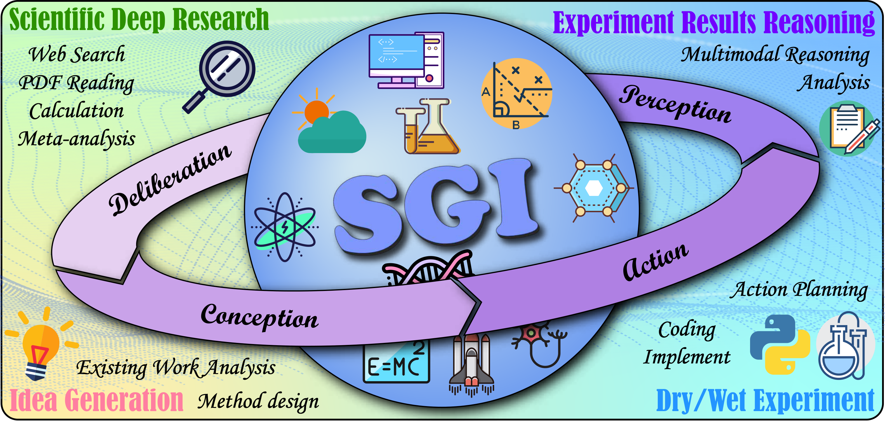

- Deliberation（审思/深度研究）：面对复杂问题进行检索、证据综合与批判评估；
- Conception（构思/创意生成）：提出新假说与可执行的研究方法；
- Action（行动/实验执行）：把想法转化为计算/仿真实验（dry）与实验室流程（wet）；
- Perception（感知/结果解读）：整合多模态证据并进行因果/比较型分析。

把“能否做科学”从口号变成刻度，我们将上述4种AI能力的综合作为科学通用能力SGI的定义，并发布覆盖全流程的SGI‑Bench。首轮结果显示：闭源模型 Gemini‑3‑Pro 以 SGI‑Score 33.83/100 取得 SOTA，但距离“会做研究”的门槛仍有显著差距。在具体维度上。

- 深度研究（Deep Research ）答案准确率 18.48%：最终答案严格匹配率偏低，长链路推理末端易崩塌；
- 创意生成（Idea Generation）平均得分 39.68：新颖与详尽度高，但“可行性”弱，关键实现细节不足；
- 干实验（Dry Experiment）代码通过率 36.64%：高 SER 并不等于科学正确，数值/仿真最薄弱；
- 湿实验（Wet Experiment）平均得分32.45：步骤序列相似度低、参数易错，时间与分支协调困难；
- 实验推理（Scientific Experimental Reasoning）答案准确率41.92%：因果尚可，比较型推理最难。

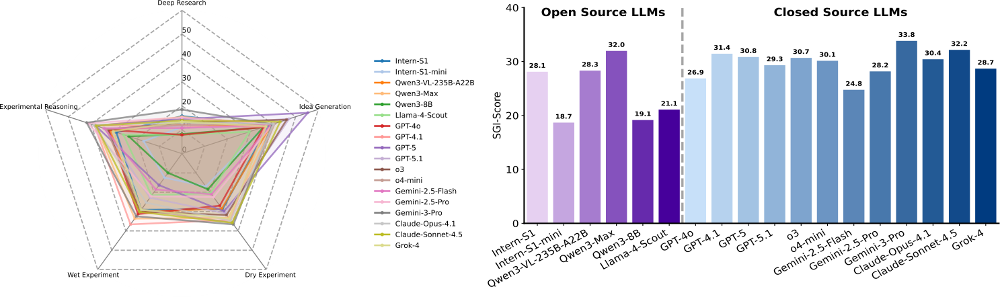

## SGI-Bench：以科学家工作流对齐的全流程评测

我们覆盖 10 大科学学科（天文、化学、地球、能源、信息、生命、材料、神经、物理与数学），问题灵感来自《Science》的“125 个重大科学问题”。为贴近真实科研，我们采用“科学家在环（scientist in the loop）”的任务构造流程：首先由多学科专家提供原始语料与示例需求（研究方向、图文证据、注释要点），以及少量的题目作为种子问题（seed questions）；随后由研究生或博士生标注者基于输入输出结构和种子问题生成题目；经规则校验（结构/格式/可执行性）、模型校验（语义一致性与逻辑缺陷过滤）与专家复核三重清洗；最后通过多模型难度筛选剔除“过易”样本，确保科学性与挑战性。

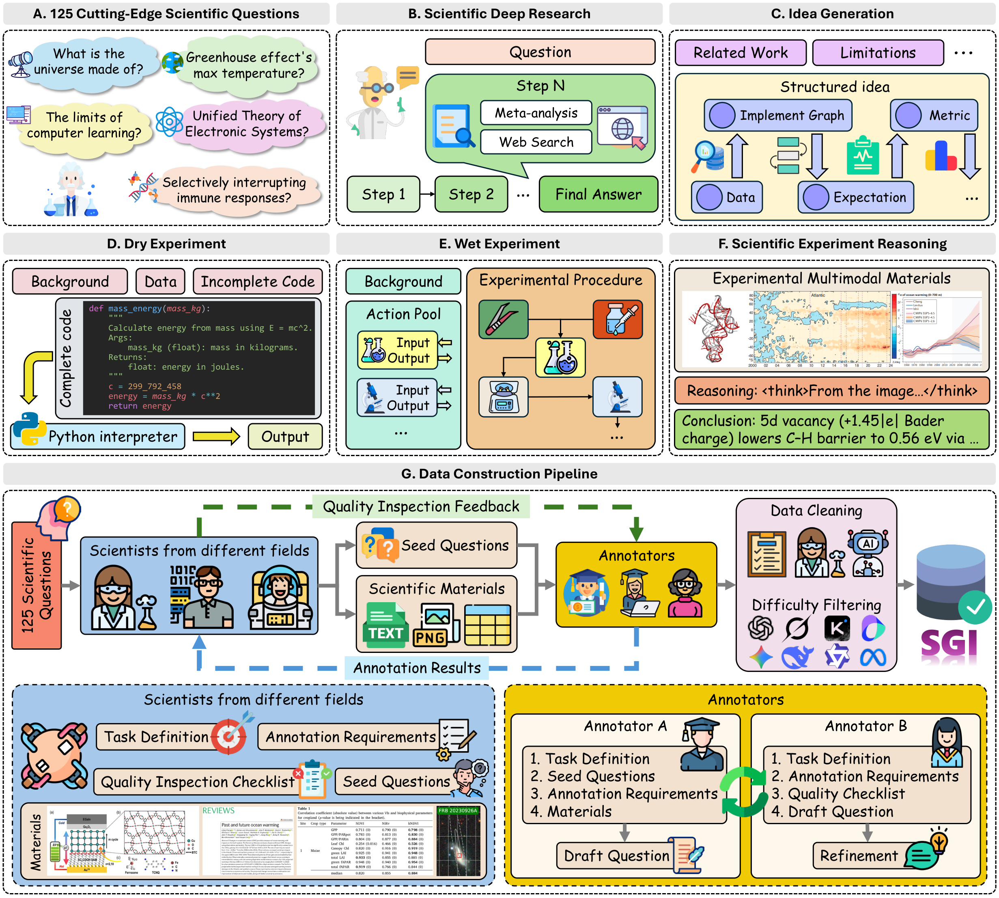

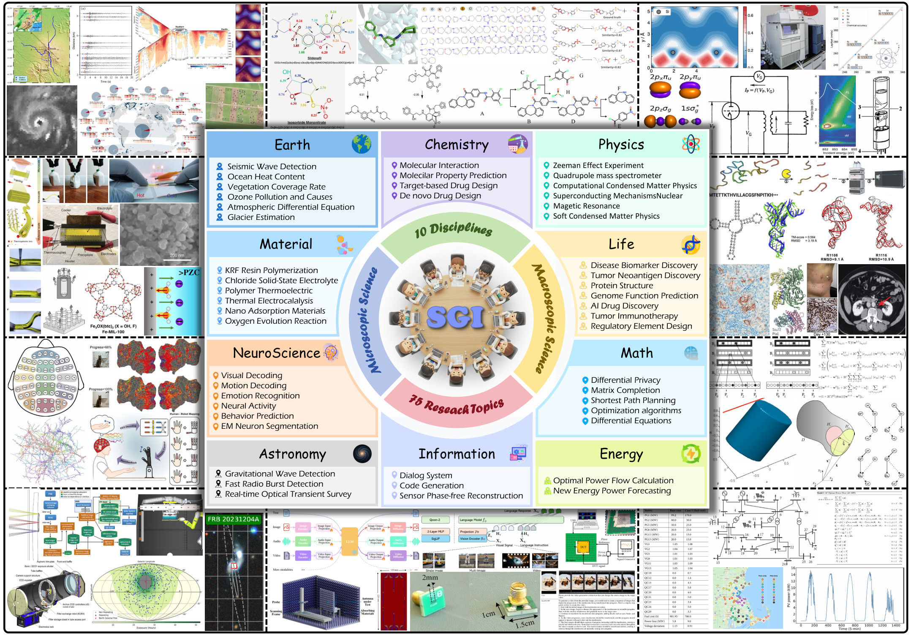

## 核心结果与洞见：今天的“强模型”，尚未成为“强科学家”

### 深度研究（Deep Research）：逐步准确率高于严格匹配，长链路“结论崩塌”
该任务模拟科研中的“系统综述/元分析 + 多跳检索”，在明确的研究背景与约束下，要求模型检索并整合跨来源证据，进行必要的定量推理并给出可核验结论。输入包含背景、约束、可能给定的数据、问题与响应要求（如单位/小数位等）；输出由“步骤化推理 + 最终答案”构成。它重点考察信息检索、证据综合、一致性检查、数值计算与单位换算能力。评价可直观理解为“最终答案是否严格正确”与“步骤是否与参考一致”。在数据/性质类问题上，该任务对跨文献的精确聚合尤为敏感。

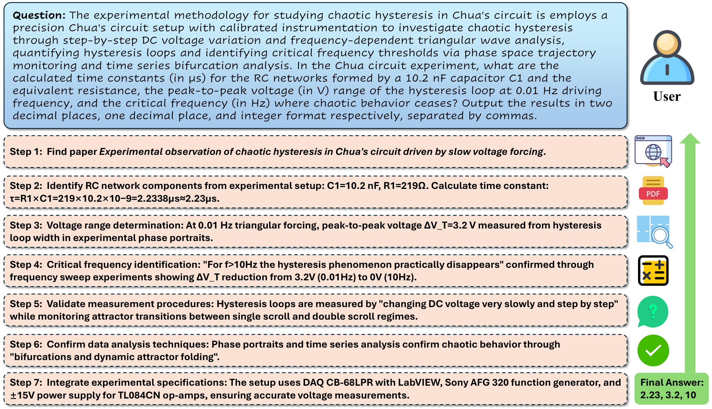

实验结果表明：

- 严格匹配（Exact Match）普遍仅在 10%–20% 区间；逐步准确率（Step‑Level Accuracy）可达 50%–65%，但在推理链尾端仍频繁失手，出现“最后一步崩塌”。  

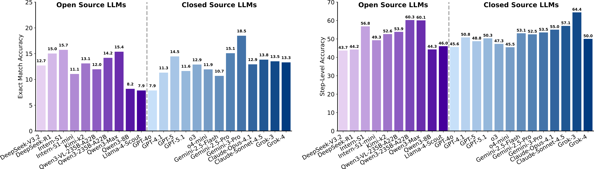

- 工具增强的多智能体在逐步准确率上略有优势，但与纯模型相比差距并不显著；部分新模型（如 Grok‑4）在本基准上不如前代（Grok‑3），显示大规模训练并不保证科学推理稳健性。 

- 同时，若干 Agent 系统在 EM 与 SLA 上不及多款 LLM，最佳 LLM 的 EM 亦可持平或超过最佳 Agent，整体分布高度重叠。
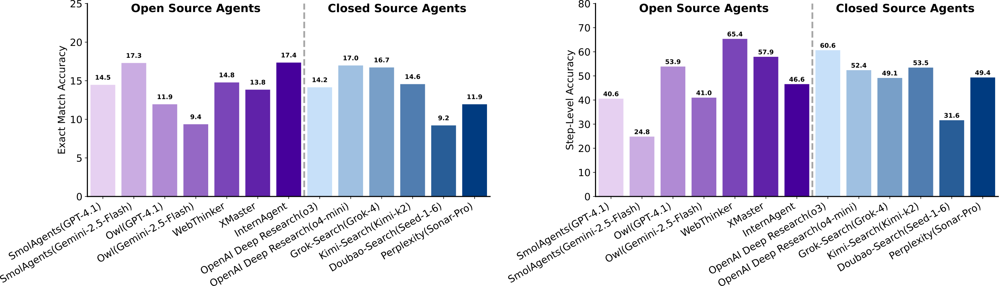

- 分类型看，“数据/性质”类题最难，需跨文献精确检索与数值聚合；“微/宏实验”类相对较好但整体仍低于 30%，体现出元分析难度对模型能力的严苛要求。

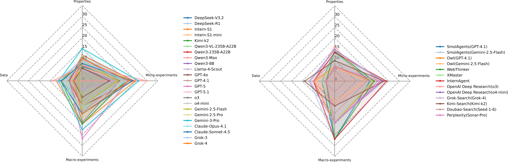

### 创意生成（Idea Generation）：新颖度高，详尽度尚可，但可行性偏低
该任务面向“方法学与方案设计”。输入包含研究方向、相关工作、挑战与局限、动机与任务目标、已有方案；输出由核心创意、实施步骤与顺序、数据选择、评价指标与预期结果组成，旨在考察模型将灵感转化为“可执行蓝图”的能力：问题定义是否清晰、是否具备创新点、实施是否参数完备与依赖一致、评测是否可复现与可判别。评估可简要把握四个向度：有效、创新、具体、可做；实践中的难点在于把“创意”落成“步骤—参数—资源”的闭环。

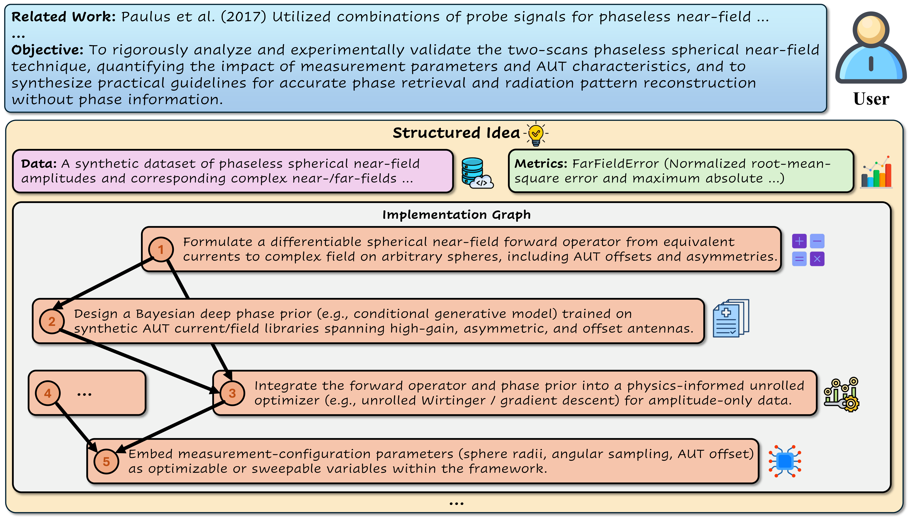

实验结果表明：

- 闭源模型在“新颖性（Novelty）与详尽度（Detailedness）”上整体更强，但在“可行性（Feasibility）”上普遍偏低。以 GPT‑5 为例：有效性（Effectiveness）40.92、新颖性 76.08、详尽度 85.72、平均分（Average）55.40 为本项最佳，但可行性仅 18.87，表明“概念丰富 ≠ 可执行方案”。  
- 可行性最佳的闭源模型为 o3（22.90），显示其在“步骤‑参数‑资源”层面相对更落地，但仍远未达科研实践所需的稳健标准。  
- 开源侧整体趋势一致：例如 Kimi‑k2 详尽度 59.20 但可行性 18.74；开源可行性上限约在 20 分左右（如 Qwen3‑8B 20.58、Qwen3‑VL‑235B‑A22B 20.14），多数模型落在 14–20 区间，体现“想法能说清”与“方案能落地”之间的系统性落差。
- 实施图谱需明确“步骤顺序/控制流（分支或迭代）/关键参数（数据来源、模型类别、训练设置）/模块间接口与依赖”，并给出可复现的评价指标与判别标准。  
- 实证中高频缺陷包括：缺少数据获取与预处理计划，流程接口不闭合（输入输出未对齐）、步骤顺序与依赖模糊，导致“创意→蓝图→执行”的闭环断裂。  

### 干实验（Dry Experiment）：可运行 ≠ 科学正确

干实验（计算/仿真）：提供科学背景、数据脚本与包含缺失函数的主代码，要求模型补全函数并在约束下正确运行，检验代码合成、数值稳健性与对科学算法的把握。可将度量直观理解为：是否在给定测试中“全部通过”，并在合理时间内稳定运行，强调严格正确与可执行，而非仅“能跑通”。

实验结果表明：

- “通过全部 5 个单元测试的比例（PassAll@5）”最佳为 36.64（Gemini‑3‑Pro）；在中等设置下 PassAll@3 为 40.46（Gemini‑3‑Pro）；在宽松设置下“通过至少 1 次（PassAll@1）”可达 42.07，但与严格标准差距明显。  

- 闭源模型在 PassAll@k 上整体略优于开源，但优势有限且分布重叠，显示“科学代码合成”仍是各架构的共同短板。
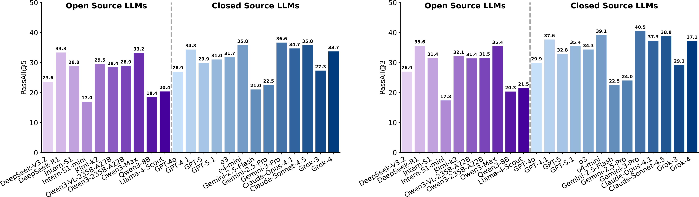

- 平滑运行率（Smooth Execution Rate）在多数前沿模型上超过 90%，但仍存在明显分化（如 Gemini‑2.5‑Flash/Pro、Qwen3‑8B、Llama‑4‑Scout、GPT‑5、GPT‑4o 较低），表明“能跑”与“算对”之间存在系统性鸿沟（最佳 98.85，Gemini‑3‑Pro）。  
- 执行时间（Average Execution Time, AET）方面，最短为 13.94s（Gemini‑2.5‑Pro），但“更快”并不意味着“更准”。
- 按功能类型看，数据处理/预测建模相对更稳；数值计算与仿真最薄弱，易受离散化、稳定性与约束处理影响。下例展示了在引力波体积估计中，前向累加（np.cumsum）与自适应积分（scipy.integrate.quad）的巨大差异：前者累积误差放大，进而通过 χ(z) 影响体积元素 dV/dz，导致最终体积严重偏离。

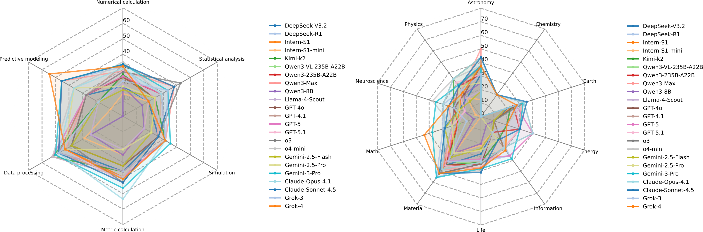

一个具体案例：引力波体积估计中，使用 `np.cumsum` 进行“类前向欧拉”累积积分会在粗离散下引入显著累计误差；而 `scipy.integrate.quad` 的自适应积分能保持数值精度。前者会导致体积估计显著偏离。这不是“能不能跑”的问题，而是“是否采用正确的数值方法”的问题。

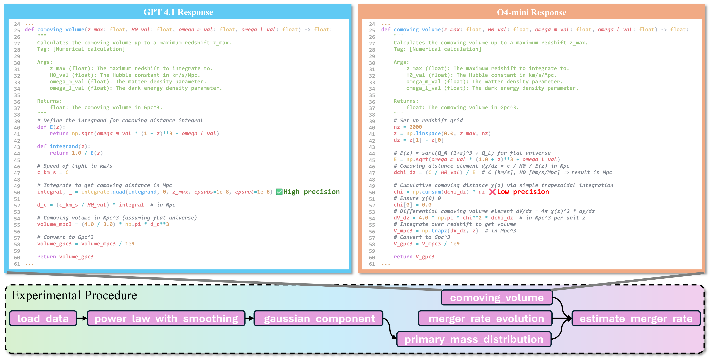

### 湿实验（Wet Experiment）：动作时序、分支与参数选择是硬伤

湿实验（实验室流程）：提供实验背景与原子动作池，要求模型生成带参数的原子动作序列，以验证流程规划、顺序依赖、参数设定与实验常识。可将度量直观理解为：动作序列是否与参考流程高度一致，关键参数是否准确，强调对时间/分支/样本等约束的正确处理。

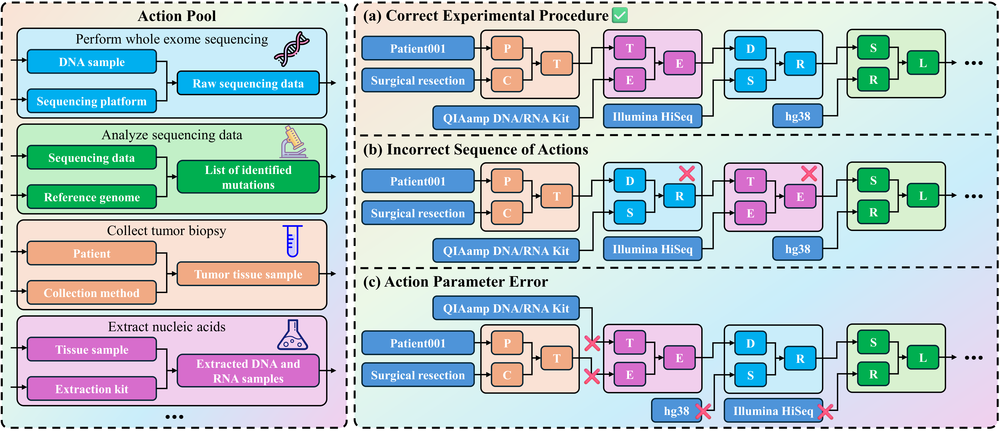

实验结果表明：

- 序列相似度（Sequence Similarity）整体偏低，最佳闭源模型约 35.5；参数准确率（Parameter Accuracy）最高约 40.6，部分开源模型在参数上可与闭源竞争；部分闭源模型在参数上也出现明显下跌（约 20.7）。  
- 评估对参数“置换等价”做同一性处理（如动作参数对调但语义一致视为正确），因此参数准确率略显乐观；但三类错误高发：插入多余步骤、遗漏关键步骤与打乱有效步骤顺序。 

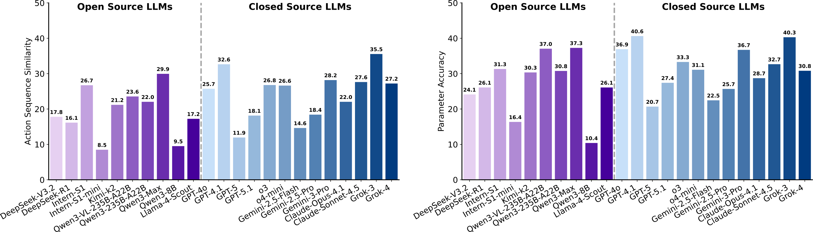
- 综合评分（WetExp）最高为 37.92（Grok‑3），但整体仍处于偏低区间。

- 在 NSCLC 抗 PD‑1 流程中，常见错误包括把纵向采样简化为一次采血、PBMC 仅在单一时间点分离、功能测定未按时间/刺激分组、基因组测序与免疫表型流程混用样本等，反映模型在时间协调、分支规划与样本管理上的薄弱。

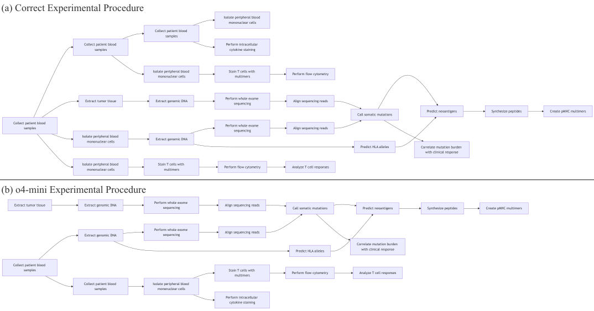

### 多模态实验推理（Experimental Reasoning）：因果推理尚可，比较推理最难
强调多模态证据的综合解读。输入由多张实验相关图像（流程、观测、实验、仿真、可视化等）与问题构成；输出包含可读的推理过程与最终答案。它考察模型对跨模态线索的识别、变量关系建模、跨样本比较与因果判断能力；可将度量简要理解为“答案是否正确”与“解释是否合理可复查”。在真实科研中，这对应数据分析与结果解读，是将观察转化为结论与假说修正的关键环节。

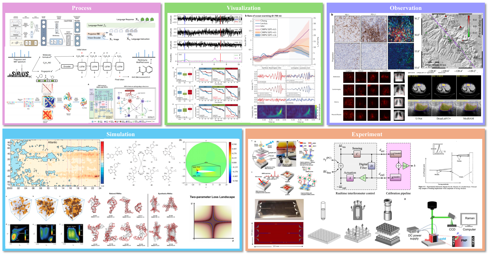

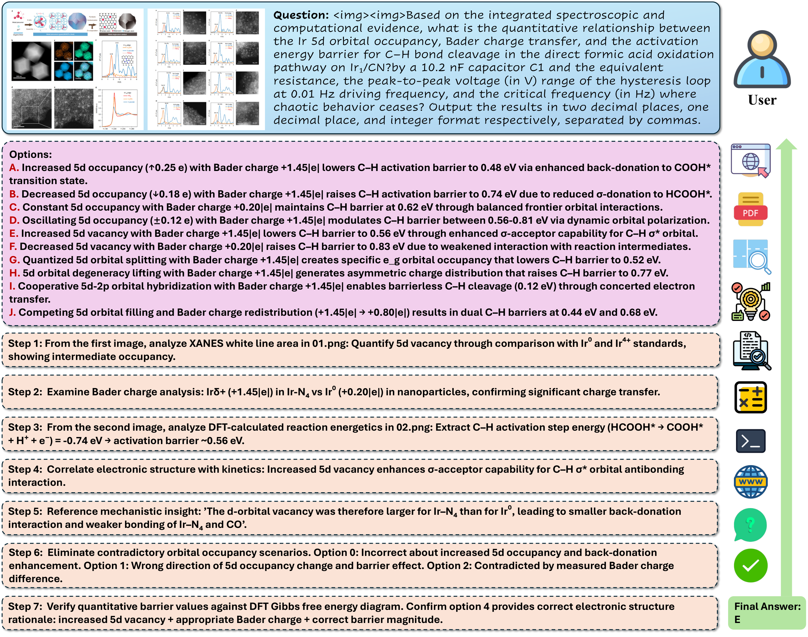

实验结果表明：

- 多选准确率（Multi‑choice Accuracy）与推理有效性（Reasoning Validity）均显示闭源模型整体更强：最佳闭源多选准确率约 41.9，推理有效性最高约 57.1；但亦有开源模型在单项上超越部分闭源（如 Qwen3‑VL‑235B‑A22B 的推理有效性约 50.5，高于 GPT‑4o 的约 45.4）。
- 多数模型的推理有效性（RV）普遍高于多选准确率（MCA）：即使最终选项不正确，解释往往仍保持部分逻辑一致性。

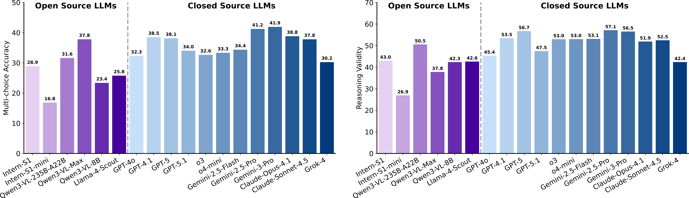
- 闭源模型的方差中等、整体较稳；仅少数模型（如 Intern‑S1‑mini）明显较低，提示规模对稳健的多模态科学推理具有重要作用。

- 推理类型上，因果推断与感知识别相对更稳；比较型推理最弱，涉及跨样本细粒度对比与一致性判别。学科上，天文最佳，其次化学、能源与神经科学；材料、生命、地球科学更具挑战，受视觉线索异质性与强背景依赖影响更大。

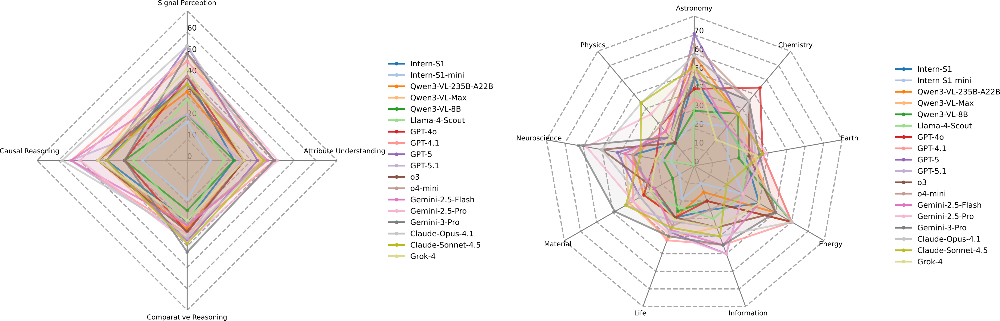

## 现场进化：测试时强化学习（TTRL）带来“无需答案”的增长

科学创意生成没有“标准答案”，传统离线监督难以奏效。我们提出在推理时通过“新颖性奖励”进行自我优化的 TTRL：

- 流程：在线检索相关文献 → 计算语义相似度 → 构造新颖性奖励（越不相似越得分） → 使用 GRPO 优化策略。  

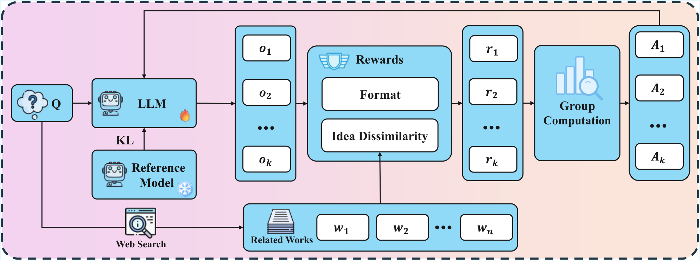

- 基座模型：Qwen3-8B（开源）。  
- 结果：无需标注，创意新颖度由 49.36 提升至 62.06；生成结构更具体，从“拼装套路”走向“结构化创新”。

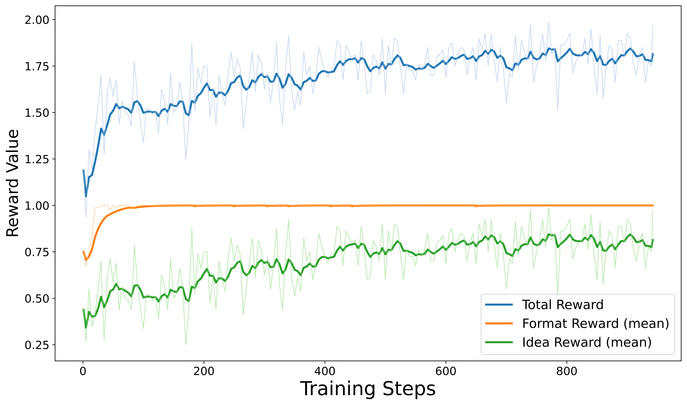

这提示我们：SGI 不是静态属性，而是可以在测试时通过弱反馈不断涌现与进化的能力。下一步，将“新颖性”与“严谨性/可行性/成本/安全”等多目标奖励组合，才是走向“可靠创新”的关键。

## 结语：SGI-Bench 不止一个基准，更是一条路线图

通过SGI-Bench的结果，可以为未来AI进行自主科研指明前进方向：

1. 深度研究：需强化证据聚合与数值鲁棒性，以提升深层研究的准确性。 
2. 创意生成：引入规划感知与结构化监督，确保科学创意的可行性与执行细节。 
3. 代码生成：代码训练需超越语法层面，聚焦数值分析先验与算法稳定性。 
4. 湿实验协议：结合状态模拟技术，重点解决实验协议中的时序逻辑与复杂分支问题。 
5. 多模态推理：通过细粒度视觉定位与对比训练，提升多模态比较推理的精确度。 
6. 测试时学习：优化多目标科学奖励体系，平衡新颖性、严谨性与安全性。